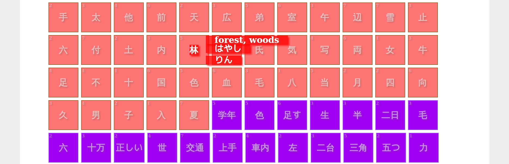

# WanikaniKunren
Training HTML application for Wanikani

## Usage
First, put your API key into a file called `apikey`.

Then, call `./update.sh` to load the json data required
to run the application.

Finally, visit ´./index.html´ with your favorite browser.

## Parameters
You can pass parameters to the url when viewing in a browser.
The available parameters are:

* `level=X` - only show the items of level `X`
* `order=X` - order items (in each category of radical/kanji/vocab, these don't get mixed) in increasing
  order using the key `X` of the `item.user_specific` json object for each item, meaningful values include
  * `srs_numeric`
  * `reading_current_streak`, `reading_max_streak`, `reading_correct`, `reading_incorrect`
  * `meaning_current_streak`, `meaning_max_streak`, `meaning_correct`, `meaning_incorrect`
  * `available_date`, `unlocked_date`, `burned_date`

# License
MIT
